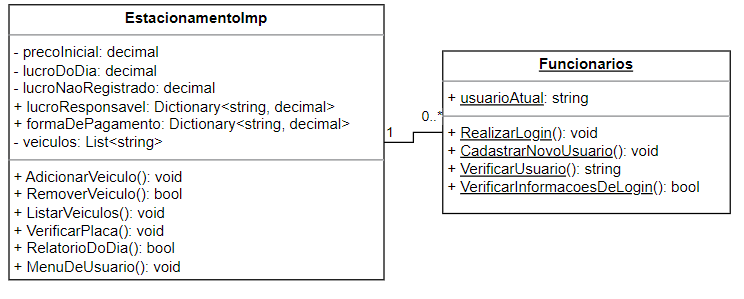

# 🚘 Projeto Estacionamento 🚘

## Sumário

* [Contexto e escopo do projeto](#contexto-e-escopo-do-projeto)

* [Informações sobre o projeto e sobre mim](#informacões-sobre-o-projeto-e-sobre-mim)

  * [Notas](#notas)

  * [Modificações](#modificações)

* [Informações sobre o código](#informacões-sobre-o-código)
  
  * [EstacionamentoImp](#estacionamentoimp)

    * [Propriedades](#propriedades)

    * [Métodos](#métodos)
 
  * [Funcionarios](#funcionarios)

    * [Propriedades](#propriedades-1)

    * [Métodos](#métodos-1)

  * [Pasta de Exceptions](#pasta-de-exceptions)

---

## Contexto e escopo do projeto

Este projeto foi desenvolvido com a tecnologia C# a partir das seguintes instruções do curso DecolaTech Avanade, da Digital Innovation One:
> Você foi contratado para construir um sistema para um estacionamento, que será usado para gerenciar os veículos estacionados e realizar suas operações, como por exemplo adicionar um veículo, remover um veículo (e exibir o valor cobrado durante o período) e listar os veículos.

O projeto para entrega pode ser acessado [Aqui](https://github.com/digitalinnovationone/trilha-net-fundamentos-desafio)

---

# 📚 Informações sobre o projeto e sobre mim

### Notas
Após o termino do bootcamp, eu decidi alterar os projetos desenvolvidos no mesmo. De início me senti perdido, sem ter nenhuma ideia de como modificar um projeto, sem fugir do escopo trazido inicialmente, ao ponto de que ele refletisse a minha personalidade e características. Quando comecei a realizar alterações básicas no projeto do estacionamento, as ideias passaram a fluir e desde então dedico, todos os dias, parte do meu tempo livre  a aprender mais do C# enquanto construo esse projeto. Hoje posso garantir que, apesar de estar ciente de existirem diversos aspectos em que posso melhorar, estou orgulhoso do que eu desenvolvi.

### Modificações

 **Robustez :** Inicialmente, eu implementei garantias de que o sistema não seria encerrado abruptamente devido a algum erro, para isso utilizei conjuntos de if-else que garantiram a não inserção de dados inválidos. Posteriormente, aprendi a como lidar com exceptions e as inseri em meu projeto como uma forma de torna-lo mais compreensível e menos poluído.

**Aparencia :** Eu inclui, tanto no começo do meu projeto quanto nas funcionalidades mais recentes, comandos para limpar o console e quebrar as linhas a fim de tentar facilitar o entendimento da execução do meu programa.

**Confiabilidade :** Enquanto testava o código, pensando em como melhorá-lo, percebi que qualquer valor poderia ser passado como uma placa devido à falta de informações contidas no sistema. A fim de resolver isso, busquei aprender sobre como definir um padrão a ser seguido pelas strings e descobri a ferramenta Regex, a qual também acabou sendo usada em outros momentos do código por sua flexibilidade e clareza.

**Utilidade :** Ao longo desse período de modificações eu fui desenvolvendo novas funcionalidades para o sistema de estacionamento. Por acompanhar a minha evolução com a linguagem, mesmo tentando otimizar e padronizar o código, essas funcionalidades contam com diferentes níveis de complexidade e organização. Elas variam desde ferramentas úteis para a gestão e contabilidade, até ferramentas que tornam o uso do sistema mais eficiente para funcionários e clientes.

---

# 🔧 Informações sobre o código

As duas classes principais deste projeto são "EstacionamentoImp" e "Funcionarios", nesta seção eu irei detalhar mais suas propriedades, métodos e o intuito de cada escolha

## 🚗EstacionamentoImp

### Propriedades

* Propriedades inicializadas como decimal para tratarem valores monetários:
  * **precoInicial**: É o preço cobrado para deixar seu veículo estacionado.
  * **precoPorHora**: É o preço por hora que o veículo permanecer estacionado.
  * **lucroDoDia**: É o valor total recebido durante a execução do programa.
  * **lucroNaoRegistrado**: É o valor recebido sem que algum funcionário estivesse logado.
 
* Propriedades inicializadas como dicionários para criar relações de Chave-Valor
  * **lucroResponsavel**: Guarda quanto foi recebido (decimal) durante o expediente de cada funcionário(string).
  * **formaDePagamento**: Guarda quanto foi recebido (decimal) em cada forma de pagamento(string).
  * **blocosEstacionamento**: Representa os blocos do estacionamento (string) e a coleção de veículos estacionados neles(lista).

### Métodos

* **Descrevem ações que podem ser realizadas ao interagir com a classe:**

  * **AdicionarVeiculo**: Método responsável por receber uma placa digitada pelo usuário e designar a um bloco caso seja válida.
  
  * **RemoverVeiculo**: Método responsável por verificar se um determinado veículo está estacionado e realizar o seguinte cálculo:

    `valorTotal = precoInicial + precoPorHora * horas`

    exibindo o resultado para o usuário e solicitando a forma de pagamento. Por fim, atualiza os dados relevantes para o relatório.
  
  * **ListarVeiculos**: Lista todos os veículos presentes em cada bloco do estacionamento. Caso não haja nenhum, exibe a mensagem "Não há veículos estacionados".
  
  * **MenuDeUsuario**: Oferece opções de cadastro ou login aos funcionários que utilizam o sistema.
  
  * **RelatorioDoDia**: Gera e informa um relatório dividido em três partes, sendo a primeira um relatório do valor gerado durante o expediente de cada funcionário, a segunda com o valor pago em cada forma de pagamento e a terceira informando o lucro total do dia.

* **Descrevem validações realizadas dentro de outros métodos:**

  * **VerificarPlaca**: Realiza validações na placa informada como parâmetro, com o intuito de garantir a adequação ao padrão mercosul ou nacional único.

  * **BuscarVeiculo**: Possui Duas sobrecargas, uma que não recebe parametros e retorna verdadeiro caso o veículo informado esteja no estacionamento; e outra que recebe uma placa e retorna o bloco onde determinado veículo se encontra, ou nulo se não existir.

  * **VerificarCapacidadeBloco**: Recebe um bloco como parâmetro e retorna o bloco informado se houverem vagas disponíveis, ou um erro caso não houver;

[Voltar ao sumário](#Sumário)

## 👩🏽‍💼Funcionarios

É uma classe estática, de forma a tornar mais fácil o acesso de seus métodos e propriedades

### Propriedades

A única propriedade inicializada no escopo geral da classe é a string "usuarioAtual", utilizada na interface do menu de usuário e na elaboração do relatório.

### Métodos

* **Descrevem ações que podem ser realizadas ao interagir com a classe:**

  * **RealizarLogin**: Recebe os dados de entrada "nomeDeUsuario" e "senha", depois manda essas informações para serem verificadas, em caso de sucesso atualiza a string "usuarioAtual" para o nome de usuario informado.
    
  * **CadastrarNovoUsuario**: Recebe um "nomeDeUsuario" e verifica se o nome digitado já existe no registro, em caso negativo solicita a entrada de uma senha. Caso a senha digitada seja adequada ao padrão estabelecido (quatro algarismos), inclui os dados do novo usuário no arquivo de registro .txt.

* **Descrevem validações realizadas dentro de outros métodos:**
  
  * **VerificarUsuario**: Método responsável por retornar a string privada "usuarioAtual".
    
  * **VerificarInformacoesDeLogin**: Método responsável por ler o registro com informações de login e comparar com as informações recebidas como parâmetros. Retorna verdadeiro em caso de sucesso, do contrário retorna uma exception.

[Voltar ao sumário](#Sumário)

---

# 📚Pasta de Exceptions

Inclui as principais falhas encontradas por mim durante o desenvolvimento e teste do projeto, além de exceções utilizadas para construir algumas das lógicas do sistema

## ❗EstacionamentoImpExceptions

* **EstacionamentoNaoVazioException**: Lançada pelo método "RelatorioDoDia" para impossibilitar o encerramento enquanto houverem carros estacionados.

* **PlacaInvalidaException** e **PlacaVaziaException**: Lançadas pelo método "VerificarPlaca" durante a validação da placa informada.

## ❗FuncionariosException

* **InformacoesDeLoginIncorretasException**: Lançada pelo método "verificarInformacoesDeLogin", caso o arquivo .txt não contenha correspondência com os dados informados.

* **NomeDeUsuarioInvalidoException**, **NomeDeUsuarioJaUsadoException** e **SenhaInvalidaException**: Lançadas pelo método "CadastrarUsuário" caso os dados de entrada não se adequem aos padrões estabelecidos, ou no caso de o nome de usuário informado já existir no registro.

* **NomeDeUsuarioVazioException** e **SenhaVaziaException**: Lançadas pelo método "RealizarLogin" caso as entradas sejam espaços em branco ou nulas.

[Voltar ao sumário](#Sumário)
